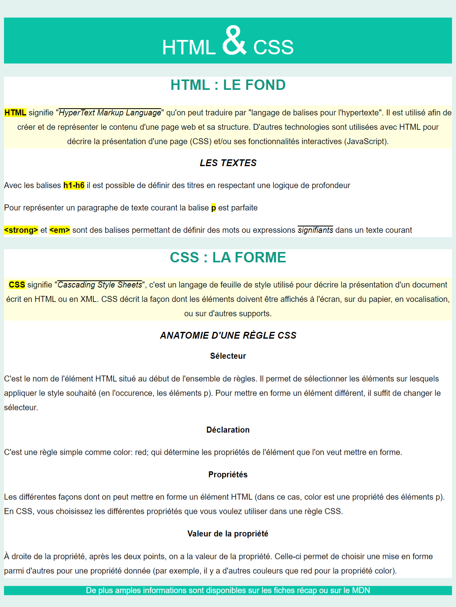
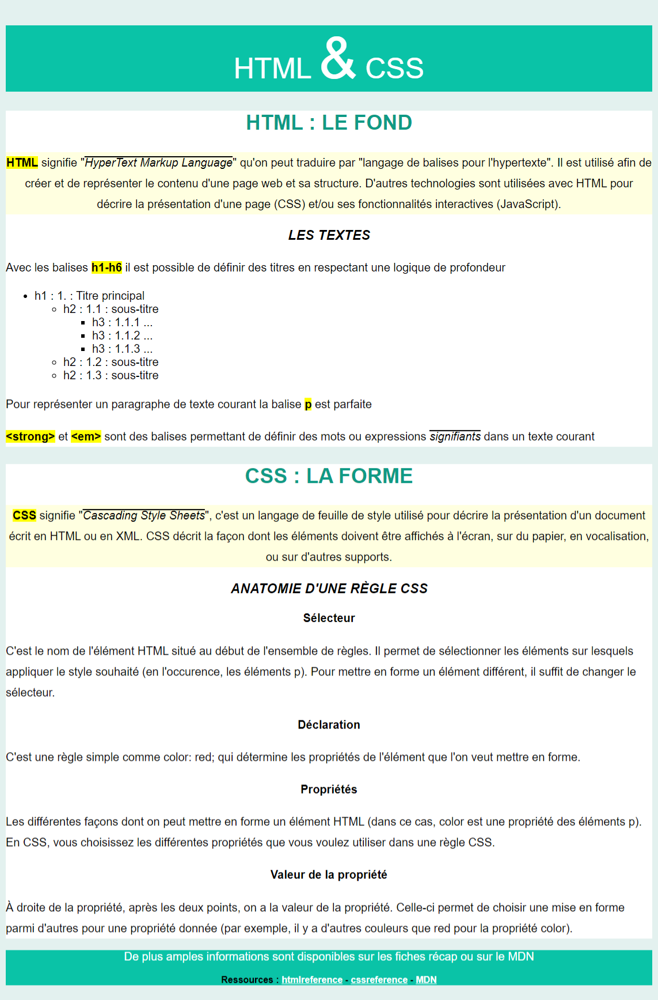

# Challenge : Fiche de lecture HTML & CSS

Aujourd'hui, on s'exerce à structurer une page Web avec HTML puis on explore quelques possibilités de CSS.

## Instructions

Vous avez vu comment créer des pages HTML et comment écrire des directives CSS simples. Voyons ce qu'on peut faire avec tout ça.

1. Cloner ce dépôt dans votre répertoire _S01_ (qui se trouve dans votre répertoire "html")
2. Liez la feuille de style `css/style.css` au fichier HTML `html/index.html`
3. Faire le code HTML
4. Ajoutez des règles de styles dans `css/style.css` pour que le rendu de la page corresponde à l'image
5. Lisez l'[aide](#aide), ça aide !
6. Servez-vous des textes fournis ;)

:warning: Sur ces screenshots, quelques pixels ont été tronqués, il y a bien un espace sur fond vert à droite :wink:

## Aide

Pour réaliser cette intégration HTML/CSS, vous allez avoir besoin d'apprendre ou de vous rappeler certaines notions :

- utilisation des [balises div et span](https://github.com/O-clock-Alumni/fiches-recap/blob/master/html/structure.md#s%C3%A9mantique-oui-mais-pas-que-) qui permettent de cibler une partie de la page
  - [MDN `
`](https://developer.mozilla.org/fr/docs/Web/HTML/Element/div)
  - [MDN ``](https://developer.mozilla.org/fr/docs/Web/HTML/Element/span)
- [ciblage par classe](https://github.com/O-clock-Alumni/fiches-recap/blob/master/css/syntaxe.md#classes)
- [MDN font-size](https://developer.mozilla.org/fr/docs/Web/CSS/font-size)
- [MDN background-color](https://developer.mozilla.org/fr/docs/Web/CSS/background-color)
- https://unicode-table.com/fr/ pour le code des "caractères spéciaux" (comme `<` et `>`, signes "inférieur" et "supérieur")

## BONUS

- Représentez la logique de profondeur des titres avec des listes, quelques exemples sont disponibles [ici](https://developer.mozilla.org/fr/docs/Web/HTML/Element/ul)
- Ajoutez des liens en bas de page vers les sites
  - https://htmlreference.io
  - https://cssreference.io
  - https://developer.mozilla.org/fr/
- Les liens changent de couleur lorsqu'on les survole, cette page du [MDN](https://developer.mozilla.org/fr/docs/Web/CSS/:hover) pourrait s'avérer utile :)

## Super BONUS

- Ajoutez l'image `https://mdn.mozillademos.org/files/11525/CSS.svg` dans la page
- Ajoutez une bordure noire
- Arrondissez la bordure

> Vous pouvez ajouter d'autres images si le coeur vous en dit mais où trouver des images rapidement ? Certains sites comme [picsum photos](https://picsum.photos/), [unsplash](https://source.unsplash.com/) ou [lorempixel](http://lorempixel.com/) peuvent vous permettre d'utiliser des photos simplement.
>
> Par exemple pour afficher cette photo
>
> 
>
> il suffit d'utiliser cette URL : `https://picsum.photos/100`
